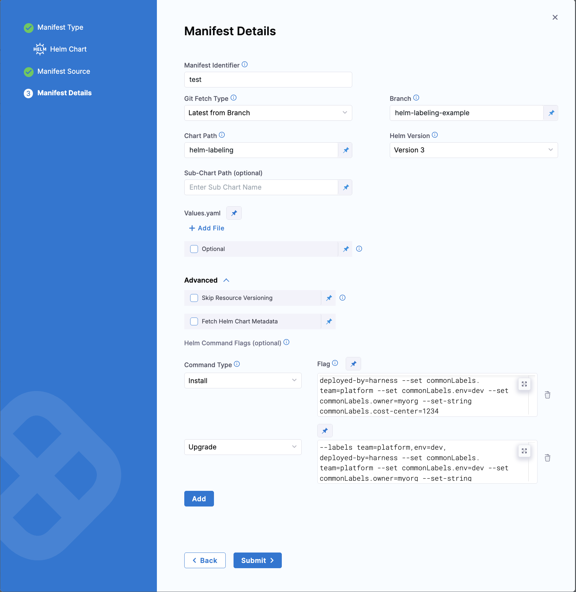

# Helm Labeling with Command Flags

This example demonstrates how to use Helm command flags in Harness to apply labels at two levels:
1. **Helm Release Labels** - Labels stored in Helm release metadata
2. **Kubernetes Resource Labels** - Labels applied to actual K8s resources (pods, deployments, services)

---

## Overview

- **Deployment Type**: Native Helm
- **Language/Tooling**: Helm 3.x, Kubernetes 1.21+
- **Goal**:
  1. Apply labels to Helm releases for release tracking and auditing
  2. Apply labels to Kubernetes resources for cost allocation, monitoring, and filtering
- **Use Case**: If you need to track releases by team/environment/owner AND filter Kubernetes resources by custom labels for cost allocation, monitoring, or compliance, this approach provides comprehensive labeling at both levels.

---

## What Gets Labeled

### Option 1: Helm Release Labels (`--labels` flag)
- Stored in Helm release metadata (Kubernetes secrets/configmaps)
- Queryable with `helm list --selector`
- Use cases:
  - Track releases by team, environment, or owner
  - Release auditing and compliance
  - Release history tracking

### Option 2: Kubernetes Resource Labels (`--set commonLabels.*` flag)
- Applied to actual Kubernetes resources (pods, deployments, services)
- Queryable with `kubectl get -l`
- Use cases:
  - Cost allocation by cost-center or team
  - Resource monitoring and filtering
  - Network policies and pod selection
  - Integration with monitoring tools (Prometheus, Datadog)

---

## Service Configuration

The service uses `NativeHelm` deployment type (not `Kubernetes`) to ensure Helm command flags are properly applied.

**For complete service YAML, refer to [service.yaml](./service.yaml)**

### Key Configuration

```yaml
serviceDefinition:
  type: NativeHelm
  spec:
    manifests:
      - manifest:
          type: HelmChart
          spec:
            store:
              type: Github
              spec:
                connectorRef: <your-github-connector>
                gitFetchType: Branch
                folderPath: helm-labeling
                branch: helm-labeling-example
            helmVersion: V3
            commandFlags:
              # Helm release labels
              - commandType: Install
                flag: "--labels team=platform,env=dev,deployed-by=harness --set commonLabels.team=platform --set commonLabels.env=dev --set commonLabels.owner=myorg --set-string commonLabels.cost-center=1234"
              
              - commandType: Upgrade
                flag: "--labels team=platform,env=dev,deployed-by=harness --set commonLabels.team=platform --set commonLabels.env=dev --set commonLabels.owner=myorg --set-string commonLabels.cost-center=1234"
```

### Important Notes

1. **Use `NativeHelm`** - The `Kubernetes` deployment type uses `helm template` + `kubectl apply`, which doesn't respect command flags. Use `NativeHelm` instead.

2. **Avoid Reserved Label Names** - Helm reserves these label names for release metadata:
   - `name`, `owner`, `status`, `version`, `createdAt`, `modifiedAt`
   - Don't use these in `--labels` flag, but they're fine in `--set commonLabels.*`

3. **Quote Numeric Values** - Use `--set-string` for numeric labels like `cost-center=1234` to ensure they're treated as strings, not numbers.

4. **Combine Flags in Single Entry** - All flags for a command type must be in one line:
   ```yaml
   - commandType: Install
     flag: "--labels ... --set ... --set-string ..."
   ```

---

## Helm Chart Structure

The Helm chart must support label injection through `values.yaml`:

### values.yaml
```yaml
commonLabels: {}
  # team: platform
  # env: dev
```

### templates/deployment.yaml
```yaml
apiVersion: apps/v1
kind: Deployment
metadata:
  name: {{ .Chart.Name }}
  labels:
    app: {{ .Chart.Name }}
    {{- with .Values.commonLabels }}
    {{- toYaml . | nindent 4 }}
    {{- end }}
spec:
  template:
    metadata:
      labels:
        app: {{ .Chart.Name }}
        {{- with .Values.commonLabels }}
        {{- toYaml . | nindent 8 }}
        {{- end }}
```

---

## Pipeline Configuration



The pipeline uses `HelmDeploy` step (not `K8sRollingDeploy`) with verification steps:

### Key Steps

1. **Helm Deployment**
   ```yaml
   - step:
       type: HelmDeploy
       spec:
         skipDryRun: false
   ```

2. **Verify Helm Release Labels**
   ```bash
   helm list -n <namespace> --selector team=platform
   helm get metadata <release-name> -n <namespace>
   ```

3. **Verify Kubernetes Resource Labels**
   ```bash
   kubectl get pods -n <namespace> -l team=platform --show-labels
   kubectl get all -n <namespace> -l owner=myorg
   kubectl get all -n <namespace> -l cost-center=1234
   ```

---

## Label Schema

| Label | Example Value | Purpose |
|-------|---------------|---------|
| `team` | `platform` | Team ownership |
| `env` | `dev`, `prod` | Environment |
| `owner` | `myorg` | Organization/customer |
| `cost-center` | `1234` | Cost allocation tracking |
| `deployed-by` | `harness` | Deployment tool |

---

## Verification Commands

After deployment, verify both label types:

### Helm Release Labels

```bash
# List releases by team
helm list --all-namespaces --selector team=platform

# List releases by deployed-by
helm list --all-namespaces --selector deployed-by=harness

# Get release metadata
helm get metadata <release-name> -n <namespace>
```

### Kubernetes Resource Labels

```bash
# Get pods by team
kubectl get pods --all-namespaces -l team=platform

# Get all resources by owner
kubectl get all --all-namespaces -l owner=myorg

# Get resources by cost-center (cost allocation)
kubectl get all --all-namespaces -l cost-center=1234

# Show all labels on pods
kubectl get pods -n <namespace> -l app=nginx-demo --show-labels
```

### Expected Output

**Helm Release Labels:**
```bash
$ helm list -n harness-delegate-ng --selector team=platform
NAME            NAMESPACE             REVISION  STATUS    CHART
release-xyz     harness-delegate-ng   1         deployed  nginx-demo-1.0.0
```

**Kubernetes Resource Labels:**
```bash
$ kubectl get pods -n harness-delegate-ng -l team=platform --show-labels
NAME                    READY   STATUS    LABELS
nginx-demo-xxx         1/1     Running   team=platform,env=dev,owner=myorg,cost-center=1234

$ kubectl get all -n harness-delegate-ng -l cost-center=1234
NAME                              READY   STATUS    RESTARTS   AGE
pod/nginx-demo-6c6d64797c-ddx2s   1/1     Running   0          5m
pod/nginx-demo-6c6d64797c-hlrks   1/1     Running   0          5m

NAME                 TYPE        CLUSTER-IP    EXTERNAL-IP   PORT(S)   AGE
service/nginx-demo   ClusterIP   10.80.0.203   <none>        80/TCP    5m

NAME                         READY   UP-TO-DATE   AVAILABLE   AGE
deployment.apps/nginx-demo   2/2     2            2           5m
```

---

## Use Cases Enabled

With this labeling approach, you can:

1. **Cost Allocation**
   ```bash
   kubectl get pods --all-namespaces -l cost-center=1234 -o json > cost-report.json
   ```

2. **Team Resource Tracking**
   ```bash
   kubectl get all --all-namespaces -l team=platform
   ```

3. **Environment Auditing**
   ```bash
   helm list --all-namespaces --selector env=prod
   ```

4. **Compliance Reporting**
   ```bash
   kubectl get all --all-namespaces -l owner=myorg -o wide
   ```

5. **Monitoring Integration**
   - Prometheus can scrape by label selector: `pod{team="platform"}`
   - Datadog can filter by labels
   - CloudWatch metrics by tag

6. **Network Policies**
   ```yaml
   podSelector:
     matchLabels:
       team: platform
   ```

---

## Troubleshooting

### Issue: Labels not applied to resources

**Symptom**: `kubectl get pods -l team=platform` returns no results

**Causes**:
1. Using `Kubernetes` deployment type instead of `NativeHelm`
2. Chart doesn't support `commonLabels` in values.yaml
3. Templates don't reference `commonLabels`

**Solution**:
- Change service type to `NativeHelm`
- Ensure `values.yaml` has `commonLabels: {}`
- Update templates to include label injection

### Issue: Helm release labels not queryable

**Symptom**: `helm list --selector team=platform` returns no results

**Causes**:
1. Helm version < 3.1 on delegate
2. Using `Kubernetes` deployment type

**Solution**:
- Ensure Helm 3.1+ on delegate
- Use `NativeHelm` deployment type

### Issue: Error "system reserved label name"

**Symptom**: 
```
Error: user supplied labels contains system reserved label name. 
System labels: [name owner status version createdAt modifiedAt]
```

**Solution**: Remove reserved names from `--labels` flag:
```yaml
# Wrong
flag: "--labels owner=myorg"

# Correct
flag: "--labels deployed-by=myorg --set commonLabels.owner=myorg"
```

### Issue: Error "cannot unmarshal number into Go struct field"

**Symptom**:
```
Error: json: cannot unmarshal number into Go struct field ObjectMeta.metadata.labels of type string
```

**Solution**: Use `--set-string` for numeric values:
```yaml
# Wrong
flag: "--set commonLabels.cost-center=1234"

# Correct
flag: "--set-string commonLabels.cost-center=1234"
```

---

## Requirements

- **Kubernetes cluster**: 1.21+
- **Helm version**: 3.1+ (on Harness delegate)
- **Deployment type**: `NativeHelm` (not `Kubernetes`)
- **Chart compatibility**: Must support `commonLabels` in values.yaml

---

## Related Documentation

- [Harness Helm Deployments](https://developer.harness.io/docs/continuous-delivery/deploy-srv-diff-platforms/helm/helm-cd-quickstart/)
- [Kubernetes Labels and Selectors](https://kubernetes.io/docs/concepts/overview/working-with-objects/labels/)
- [Helm Install Command](https://helm.sh/docs/helm/helm_install/)
- [Helm Upgrade Command](https://helm.sh/docs/helm/helm_upgrade/)

---

## Example Repository

Complete working example with Helm chart: [vishal-av/vishal-sample-yamls](https://github.com/vishal-av/vishal-sample-yamls/tree/helm-labeling-example/helm-labeling)

**For complete pipeline YAML and service definition, refer to [pipeline.yaml](./pipeline.yaml)**
